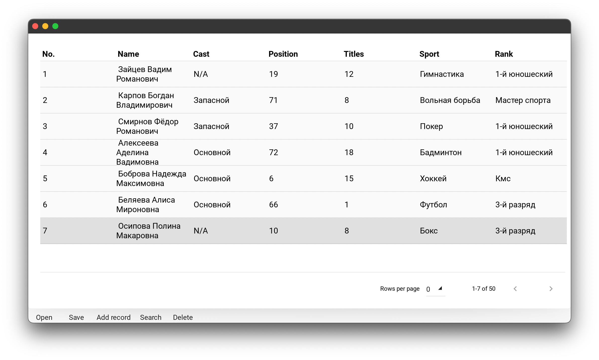
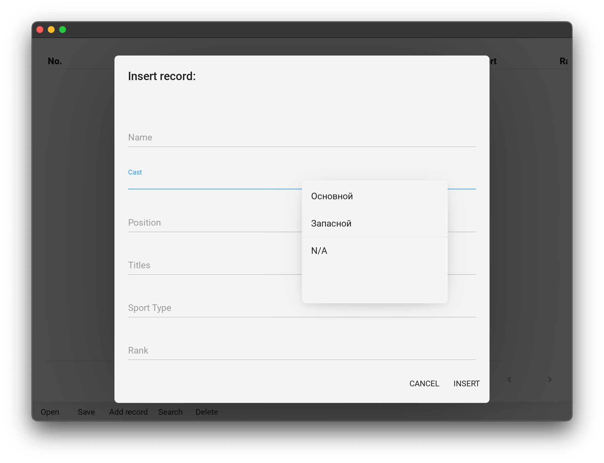
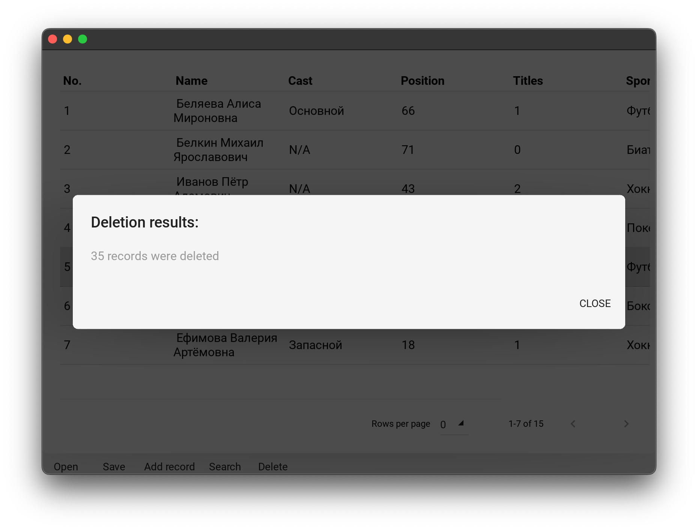

## Requirements:
   - KivyMD is API unstable as of now, it's best to use either  the version I've used on my computer (`1.0.0.dev0`), or main branch. A lot of bugs are fixed in the `main`, so, unless something's broken, install from source, not from PyPI: `pip3 install https://github.com/kivymd/KivyMD/archive/master.zip`
   - I've used a native filepicker instead of Kivy's (because kivy's picker is horrible). `pip3 install plyer` is required for it to work
## Launch:
`python3 main.py` should work. XML files for testing are located in the `./examples` folder.

## What can be improved:
 - A separate type for sending records between controller and view
 - A more sophisticated error handling system, especially for XML parser (with SAX error handler). Seemed to increase the complexity of passing the error to the view a lot, so I've made a generic error message instead, because I was near the deadline on the assignment... Eh.
 - A better way to call the app's controller (`pyright`'s complaining right now)
 - Binding data from the model directly to the view (buggy on KivyMD, see below)
 - Fix the pagination (not my fault, see https://github.com/kivymd/KivyMD/issues/1242)
 - More coherent UI: input field validators, correct sizes for the dropdown menu, action bar based on the MD guidelines, better default window size, accent colors. Honestly, I tried to create a beautiful GUI. Now I couldn't care less. By the time I've finished this project I was (and still am) hoping I won't touch Kivy or KivyMD **ever** again - here are some of the reasons why:
   - GUI is very slow (maybe OpenGL on macOS is to blame, but generally GUI is very unresponsive)
   - Lack of updated and/or full docs
   - incoherent UI elements, lack of some basic widget variations. Generally you have to write a lot of boilerplate, even for basic widgets (such as dropdown input)
   - Touch emulation creates excessive input lag
   - KivyMD's binding system is very unstable, I had to rely on callback functions and lambdas instead.
   - The layout system is intuitive, but the position customization options are not - it was a hell to figure out how to position elements correctly.
   - The DSL of Kivy (.kv) is nice, but .css would've been nicer.

## Preview:
Main window:

Insert dialog:

Search dialog flow:

Delete records notification:

